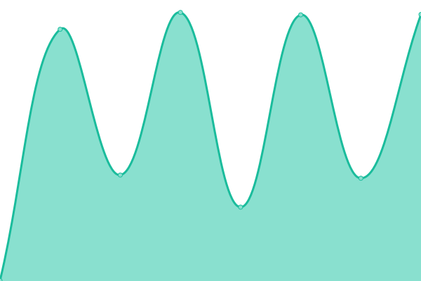
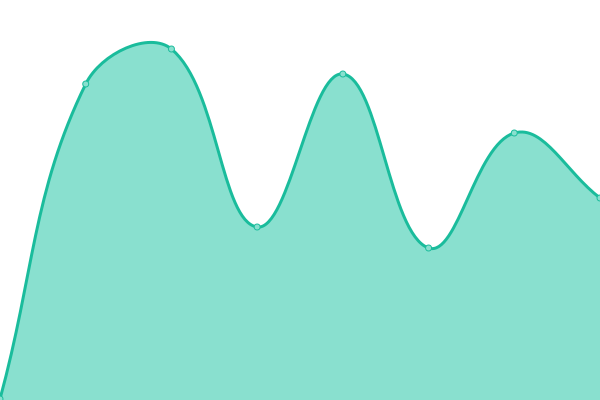
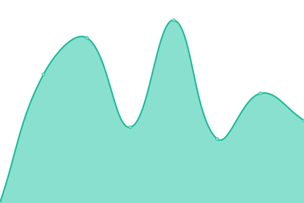

# [📈 Live Status](https://Clouddefense.AI.github.io/upptime): <!--live status--> **🟧 Partial outage**

This repository contains the open-source uptime monitor and status page for [Clouddefense.AI](https://Clouddefense.AI.github.io/upptime), powered by [Upptime](https://github.com/upptime/upptime).

With [Upptime](https://upptime.js.org), you can get your own unlimited and free uptime monitor and status page, powered entirely by a GitHub repository. We use [Issues](https://github.com/Clouddefense.AI/upptime/issues) as incident reports, [Actions](https://github.com/Clouddefense.AI/upptime/actions) as uptime monitors, and [Pages](https://Clouddefense.AI.github.io/upptime) for the status page.

<!--start: status pages-->
<!-- This summary is generated by Upptime (https://github.com/upptime/upptime) -->
<!-- Do not edit this manually, your changes will be overwritten -->
<!-- prettier-ignore -->
| URL | Status | History | Response Time | Uptime |
| --- | ------ | ------- | ------------- | ------ |
|  [CloudDefense.AI](https://www.clouddefense.ai) | 🟥 Down | [cloud-defense-ai.yml](https://github.com/CloudDefenseAI/upptime/commits/HEAD/history/cloud-defense-ai.yml) | 

 243ms
     
 | 

<a href="https://upptime.clouddefenseai.com/history/cloud-defense-ai">100.00%</a>
    

|  [CloudDefense.AI DevSecOps Portal](https://console.clouddefenseai.com) | 🟩 Up | [cloud-defense-ai-dev-sec-ops-portal.yml](https://github.com/CloudDefenseAI/upptime/commits/HEAD/history/cloud-defense-ai-dev-sec-ops-portal.yml) | 

 294ms
     
 | 

<a href="https://upptime.clouddefenseai.com/history/cloud-defense-ai-dev-sec-ops-portal">100.00%</a>
    

|  [CloudDefense.AI CloudSec Portal](https://acs-us.clouddefenseai.com) | 🟩 Up | [cloud-defense-ai-cloud-sec-portal.yml](https://github.com/CloudDefenseAI/upptime/commits/HEAD/history/cloud-defense-ai-cloud-sec-portal.yml) | 

 301ms
     
 | 

<a href="https://upptime.clouddefenseai.com/history/cloud-defense-ai-cloud-sec-portal">100.00%</a>
    

|  [CloudDefense.AI CloudSec Portal(UAE)](https://acs-uae.clouddefenseai.com) | 🟩 Up | [cloud-defense-ai-cloud-sec-portal-uae.yml](https://github.com/CloudDefenseAI/upptime/commits/HEAD/history/cloud-defense-ai-cloud-sec-portal-uae.yml) | 

 1128ms
     
 | 

<a href="https://upptime.clouddefenseai.com/history/cloud-defense-ai-cloud-sec-portal-uae">100.00%</a>
    

<!--end: status pages-->

[**Visit our status website →**](https://ClouddefenseAI.github.io/upptime)

## 📄 License

- Powered by: [Upptime](https://github.com/upptime/upptime)
- Code: [MIT](./LICENSE) © [Clouddefense.AI](https://Clouddefense.AI.github.io/upptime)
- Data in the `./history` directory: [Open Database License](https://opendatacommons.org/licenses/odbl/1-0/)
